总结2023年前后的一些基于Lidar方案的3D Detection文章和开源项目的分享。

2023年也是高阶自动驾驶方案从Demo走向量产的一年，在这一年里学术界着重讨论了3D Lidar Detection更快（Edge端更友好的模型），更高（更高的数据有效率），更强（带来提点的模型结构）的方法。

本文总结了6篇文章，分别从模型结构提升3D Detection任务的检测精度。这几篇文章分别从，**稀疏卷积算子，CNN模型结构，Transformer模型结构，后处理**几个方面改进了纯Lidar Detection任务。

**一、带来提点的模型结构**

模型结构要从算子说起，基于稀疏卷积算子的点云检测模型一直以来是3D PointCloud Detection的重要组成部分，在2022年我们见到了FocalSpconvc（cvpr 2022 oral）这样优秀的工作。近年来随着大卷积核在2D视觉任务上取得了成功，研究者在2023年挑战了3D卷积上的大kernel实现的可能性。

**1. LargeKernel3D：Scaling up Kernels in 3D Sparse CNNs**

来自Deep Vision Lab的文章，CVPR2023。作者发现3D Spconv中应用大卷积核时，并不如2D任务中那么高效。为了应对这些挑战，提出了Spatial- wise Partition Convolution，提高了3D Spconv在使用大卷积核时效率低下的问题和过拟合问题。

主要方法: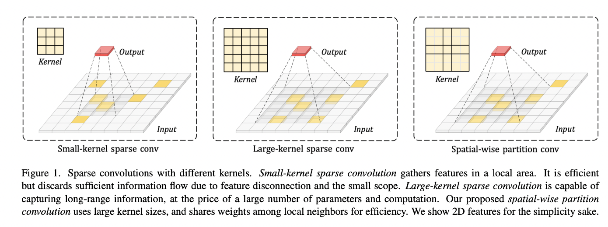

Spatial- wise Partition Convolution：和2D卷积在通道维度上共享权值，Spatial- wise Conv在空间维度上共享权值。与其在整个特征图上使用单个大卷积核，不如将特征图分成较小的区域，然后在每个区域使用卷积操作。通过在空间临域内共享权重，可以提高这些权重在训练期间的有效优化机会，因为相同的一组权重用于多个空间位置，有助于捕捉空间模式，并减少需要更新大量参数的需求。在推理阶段，可以将空间分区卷积重新构建为较小的卷积，其中特征在较大范围内进行分配。这有助于确保在推理阶段仍能够实现训练期间的权重共享优势。

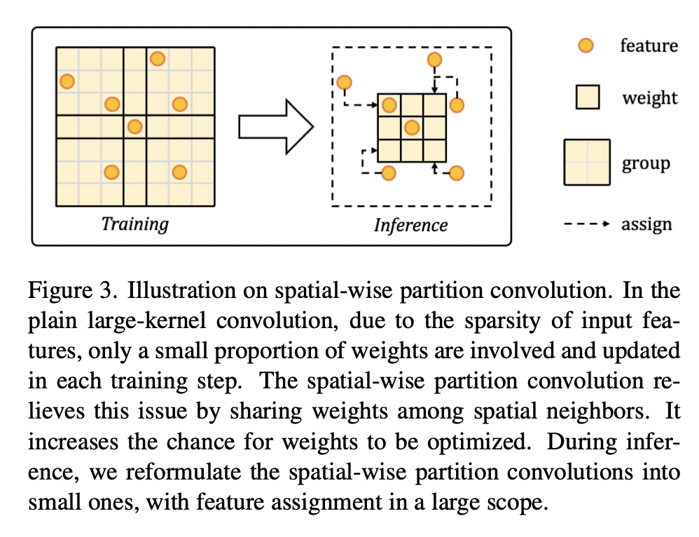./3D目标检测-六篇Lidar模型工作汇总

**Kernel-wise Position Encoding:** 考虑到空间分区卷积是以权重共享的方式设计来应对空间稀疏性。尽管这个设计是高效的，但仍然存在一个问题：在一个区域内的体素（像素的3D等效物）共享相同的权重，这导致了局部细节的模糊。当卷积核尺寸增加时，这一现象会进一步加剧。为了解决这个问题，作者提出了核位置嵌入（kernel-wise position embedding）的方法。特别是，我们初始化位置权重，这些权重对应于卷积核。在卷积过程中，允许输入特征查询等效位置的位置权重，并将它们相加在一起。这样既带来了效率又提高了模型的局部细节能力。

**2. Link: Linear Kernel for LIDAR-based 3D Perception**

来自南大媒体计算研究组，CVPR2023，第一篇的LargeKernel3D利用了空间共享权值解决3D LargeKernel Spconv的计算开销立方增长的问题。本文作者提出了不同的解决方案——Linear Kernel Generation和Block Based Aggregation方法实现了以一致的开销实现任意大小的Linear Kernel。

主要方法：

**Linear Kernel Generation**的工作过程：首先，将输入数据分割成不重叠的块，然后每个非空的体素将其特征传送给相应块的代理（proxy）。接着，中心体素仅从相邻代理中提取特征，这个推和拉的过程以可减小的方式进行，以支持每一次潜在调用时的代理的重复使用。最终生成的矩阵充当卷积核，用于加权临域特征。这个过程有助于构建LinK的卷积核，以更好地感知远距离的上下文信息，提高了3D感知的性能。

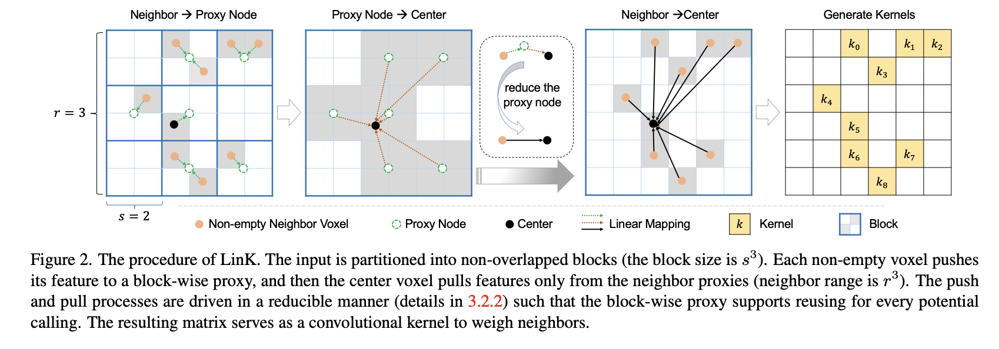

**Block Based Aggeration:** 基于local offset方法来获取权重是无法复用算子重叠区域的聚合结果的，这样在计算重叠区域时一定会引入额外的计算量。为了解决这个问题，考虑到每个位置的global coordinate是唯一的，我们提出将local offset拆分为global coordinate的组合。

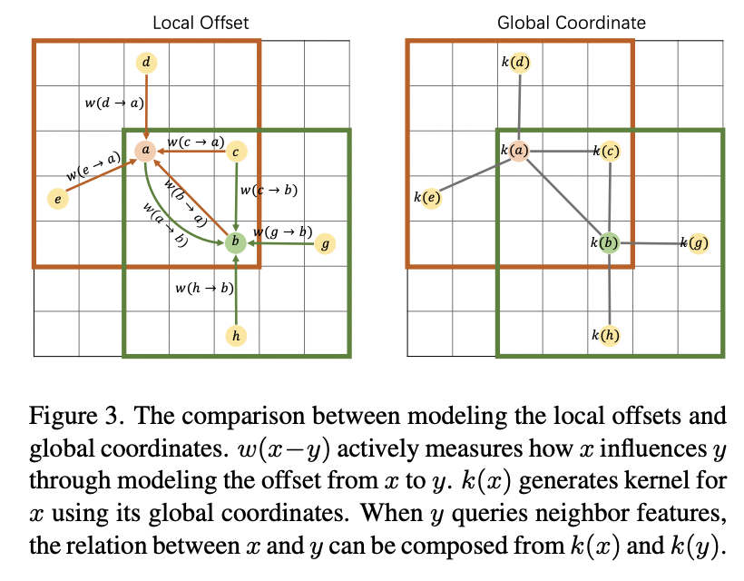

**Network Architecture：**除了算子工作外，LinK还对网络结构作了一定的优化，Link模块由两个分支组成：一个分支是使用线性投影+三角核函数实现的大核分支。另一分支是3 x 3 x 3的小核分支旁路。

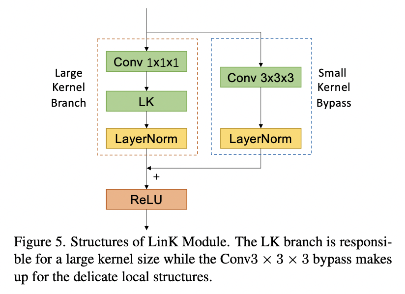

在应用到下游任务（检测和分割）中时，作者分别选取CenterPoint和MinkUnet作为基础架构，并使用基于LinK的backbone替代原本基于稀疏卷积实现的backbone，保留了原始的检测头和分割头不变，具体结构：

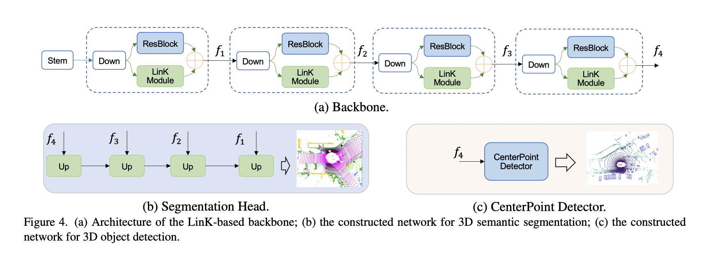

LinK和largeKernel都是完全兼容现有Spconv路线下的3D卷积方案的，都是即插即用的平替算子，事实上可以和CenterPoint，PVRCNN（替换voxel部分），VoxelNext等方案做很好的结合。

**3. PillarNeXt: Rethinking Network Designs for 3D Object Detection LiDAR Point Clouds**

CVPR 2023

虽然目前无论是基于Point还是Voxel的方案都为3D Detection带来了出色的精度和不错的推理速度，但是作者认为最简单的基于pillar结构的模型在精度和延迟方面表现出人们出乎意料的良好性能。基于这个观点，作者以2D检测任务中的很多SOTA trick为基础，在Pillar的结构下完成了精读和速度的双赢。

主要方法：

**Network Architecture：**通常基于Pillar的网络由四个部分组成：1）用于将原始点云转换为结构化特征图的Encoder；2）用于一般提取特征的Backbone；3）用于多尺度特征融合的Neck；4）用于特定任务输出的检测Head组成。基于这个背景，作者分别对这四个模块进行讨论和调优。

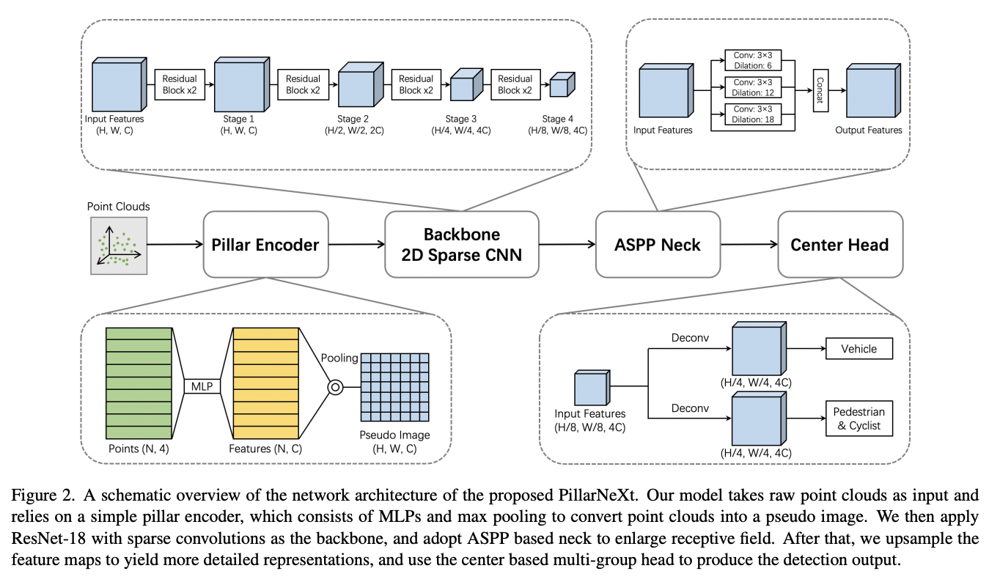

**Grid Encoder（柱状）**：基于柱状的网格编码器将点排列成垂直列，并应用多层感知器（MLP）以及最大池化来提取柱状特征，这些特征被表示为伪图像。

**Voxel（体素）**：与柱状相似，基于体素的网格编码器将点组织成体素，获取相应的特征。与柱状相比，体素编码器在高维度上保留了更多细节。

**Multi- View Fusion（MVF，多视图融合）**：基于MVF的网格编码器将柱状/体素编码和基于范围视图的表示进行融合。将柱状编码器与基于圆柱坐标的视图编码器结合起来，以将点分组。

在此基础上，通常情况下在一般的waymo任务中，会将voxel或者pillar的方案的尺寸设计成0.075作为一个比较公平的基线。作者讨论了结果的resolution对最终的检测结果的影响。不会影响诸如车辆之类的大目标的性能，但会降低诸如行人之类的小目标的精度。对输出特征分辨率（0.3到0.6）进行下采样会损害这两个类别的性能。

**Backbone**：使用基于pillar或MVF的编码器在backbone中使用稀疏2D卷积，使用基于voxel的编码器在backbone中使用稀疏3D卷积。网络结构将参考resnet18进行设计。

**Neck**：ASPP效果最佳。

**Detection Head**：作者发现如果简单地在检测头中提供上采样层，可以获得显著的改进，尤其是对于小目标。这表明细粒度信息可能已经被编码在下采样的特征图中，并且head中的简单上采样层可以有效恢复细节。

**实验结果与总结**：作者提供了一个小的trick的改进和模型最终成绩的提升路线。模型缩放，增强neck/head，训练策略的修改都会让模型产生巨大的进步。

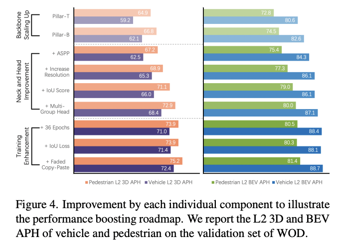

PillarNeXt其实更多的是一篇调参经验，其中的使用方法和模块基本都是耳熟能详的，不过能调到一个SOTA成绩也是相当的不易。

**4. VoxelNeXt：Fully Sparse VoxelNet for 3D Object Detection and Tracking**

这是一篇来自Deep Vision Lab的文章，发表在了CVPR2023上，之前提出的主流3D目标检测器通常依赖于手工定制proxy，比如：anchor，center，并将经过充分研究的2D框架转化为3D。这篇文章中作者提出了一种名为VoxelNeXt的全稀疏3D目标检测算法。可以直接基于稀疏体素特征预测对象，而不依赖手工定制的proxy。

主要方法：

**Additional Down-sampling**：之前PVRCNN等任务中的voxel网络一般只有四层特征，即F1，F2，F3，F4。本文在此基础上额外进行了两层采样，得到了F5和F6，并基于此将特征对齐到了F4，这样在F4层上的特征就拥有了更大的感受野。

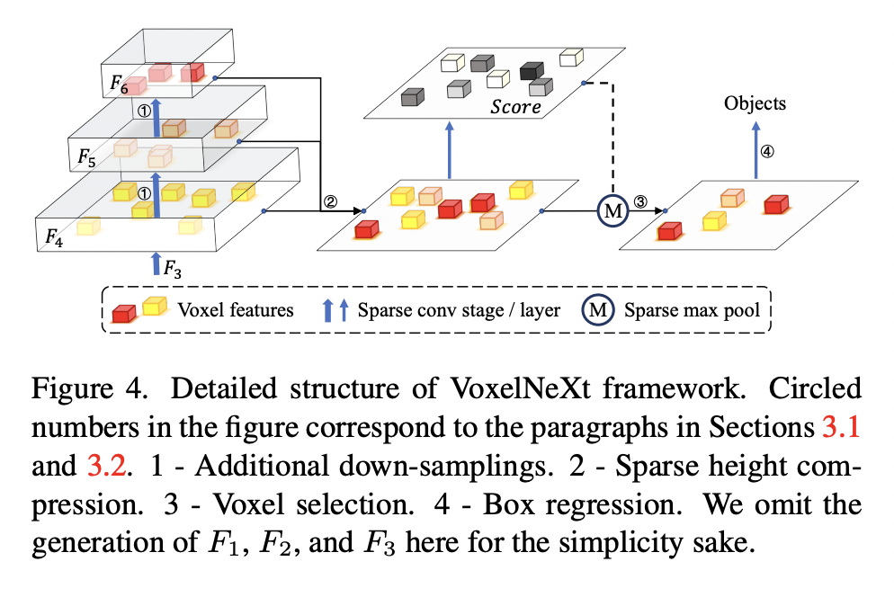 

**Sparse Height Compression**：在之前的3D目标检测器中，将3D体素特征压缩成密集的2D特征图，通过将稀疏特征转化为密集特征，然后将深度（沿着z轴）合并到通道维度。这些操作会消耗内存和计算资源。然而，在VoxelNet中，使用2D稀疏特征进行预测更加高效。这样其高度的压缩是可以完全稀疏的。作者将所有体素都放在地面上，然后对相同位置的特征进行求和。这仅需要不到1毫秒的时间。

**Spatially Voxel Pruning：**在3D场景中，通常包含大量冗余的背景点，对预测几乎没有任何益处。因此，我们在降采样层逐渐剪除不相关的体素。类似于SPS-Conv，我们抑制那些特征幅度较小的体素的膨胀，以抑制比率为0.5为例，只对那些特征幅度｜fp｜（在通道维度上求平均）位于所有体素的前一半的体素进行膨胀。这种体素的剪除大大节省了计算资源，同时不影响性能。

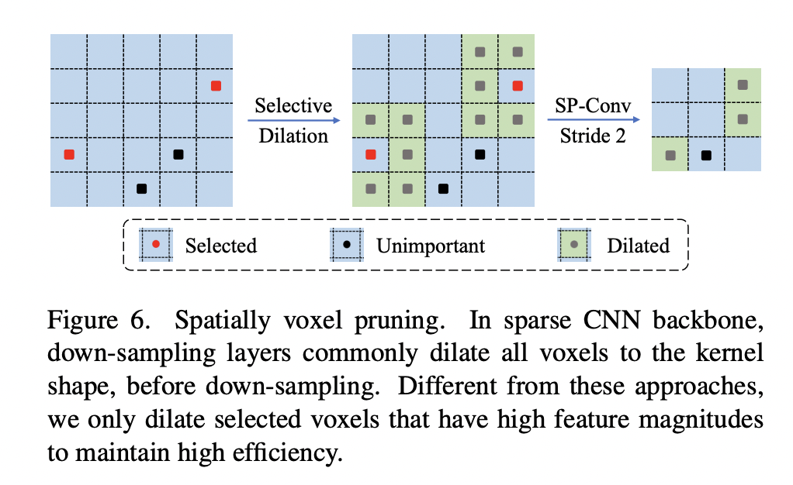

**Voxel Selection**：Detection Head部分直接基于3D CNN骨干网络的稀疏输出来预测对象。在训练过程中，将距离每个注释边界框中心最近的体素分配为正样本。使用Focal loss进行监督。需要注意的是，推理时匹配的体素通常不位于对象中心，它们甚至不一定在边界框内，为了进一步对模型进行加速，在推理期间，我们通过使用稀疏最大池化来避免NMS后处理，因为特征已经足够稀疏。

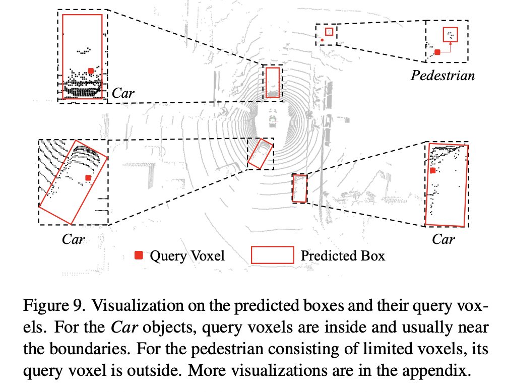

**Box Regression**：边界框直接从正样本的稀疏体素特征回归，损失使用L1损失。直接使用了3 x 3的稀疏卷积进行回归。

**实验结果和总结**：作者分别将模型在nuscenes上的成绩与SOTA进行了对比，我们加入和前面的PillarneXt对比，模型比pillarnext有更好的结果。

PillarNeXt和VoxelNeXt是2023年基于卷积方案最有代表性的两篇文章，Transformer当然也是目前很热点的研究方向。

**5. Li3DeTr: A LiDAR based 3D Detection Transformer**

哥大论文，WACV2023，文章核心是把Deformable DETR应用到了LiDAR 3D检测任务。

主要方法：

**Backbone**：为了加速大规模点云的3D目标检测，作者将点云散布到BEV网格中，并使用CNN来提取局部点的特征，测试了两种处理流程

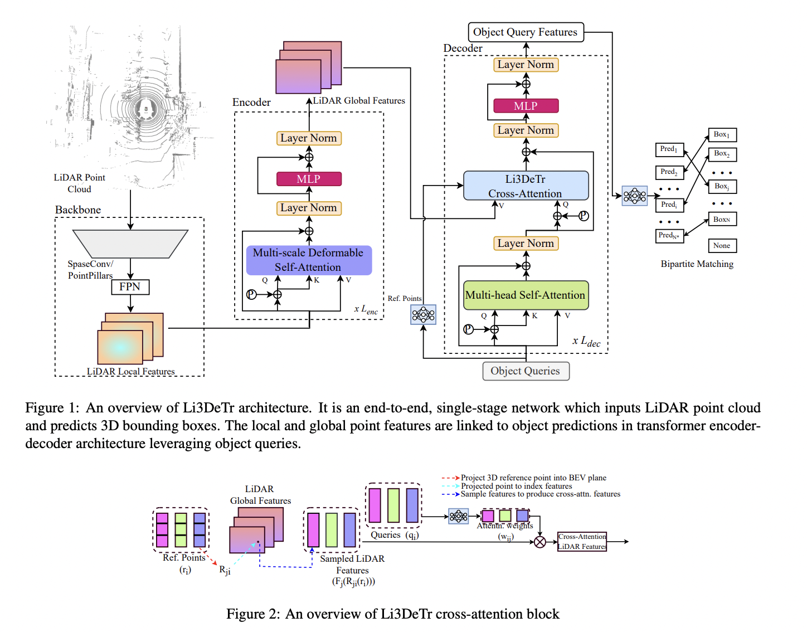

1. 使用[0.1, 0.1, 0.2]米的体素尺寸对点云进行体素化处理，然后利用SparseConv来计算3D稀疏卷积，获取局部体素特征。空的体素被填充为零，稀疏的体素被转换为类似BEV 2D网格的特征。
2. 将点云转化为密集的BEV柱状图，使用[0.2, 0.2, 0.8]米的Pillar分辨率。Pillar特征网络来处理柱状特征。最后，采用SECOND骨干网络从稀疏体素或BEV柱状特征中提取局部体素特征，并使用FPN进一步转换，得到多尺度的局部体素特征图。

**Encoder**：为了获取从局部体素特征图中提取的Global Voxel Feature，作者采用了多尺度可变注意力机制，这是为了避免在Encoder高分辨率特征图时导致不可接受的计算复杂性。多尺度可变注意力结合了可变卷积的稀疏采样和transformer的长距离关系框架，它仅关注参考点周围的一小组关键采样点，从而降低了计算复杂性。Decoder中的每个层由多尺度可变自注意力和MLP块组成，具有参差连接，并在网络中重复多次。Global Voxel Feature从Encoder中提取出来，然后传递给Decoder中的Li3DeTr交叉注意力块。

**Decoder**：与现有的3D目标检测方法不同，该方法采用解码器来进行检测，而不是预测每个pillar或使用anchor。Decoder的输入包括一组对象查询和全局Voxel Feature Map，Decoder层被多次重复以细化对象查询。在每个Decoder层中，3D参考点是用通过全连接网络编码从对象查询中得到的。Decoder层包括Li3DeTr交叉注意力块，多头自注意力块和MLP块，具有跳跃连接，用于预测一组边界框，从而消除了后处理步骤（如NMS）的需求。这种方法通过优化预测过程，提高了3D目标检测的效率和性能。

**Li3DeTr cross-attention**：Li3DeTr Cross Attention块接收了对象query，3D参考点和LiDAR全局多尺度特征图作为输入用于处理3D目标检测。该模块通过将参考点投影到不同尺度的LiDAR Global Feature中，实现了多尺度的特征采样。这些采样的特征经过一系列计算，得到了交叉注意力特征，用于更新对象查询。每个对象查询用于预测与目标框位置，大小，方向，速度和类别相关信息。

**实验结果与总结**：作者分别将模型在nuscenes上的成绩与2021年的一些SOTA进行了对比，性能没有超过Largekernel等工作。不过基于transformer的方案成功把3D NMS操作给摘掉了，一方面3D NMS操作在场景比较复杂的情况下会计算上千个proposal框，造成推理的延迟。基于transformer的方案实现了NMS free，这也为另外一个基于更高推理速度的DSVT的推理侧模型提供了基础。

**6. FocalFormer3D：Focusing on hard Instance for 3D Object Detection**

一作在Nvidia期间的工作。该研究关注了3D目标检测中的FN问题，即漏掉了行人、车辆和其他障碍物的情况，这可能导致自动驾驶中的潜在危险。作者提出了一种名为Hard Instance Probing（HIP）的通用流程，以多阶段方式实现FN识别，并引导模型专注于挖掘难以处理的实例。

**主要方法：**

该框架由两个关键组件组成：multi- stage heatmap encoder 和 deformable transformer encoder网络。multi- stage heatmap encoder采用Hard Instance Probing（HIP）策略，生成高召回率的目标查询，通过一系列阶段来选择和收集目标候选项。deformable transformer encoder网络负责处理各种目标query，它使用box pooling来增强查询嵌入，通过中间目标监督来识别局部区域，并以局部方式优化目标query。这一框架的综合作用提高了目标检测的性能，减少了假阳性（FP）的发生。

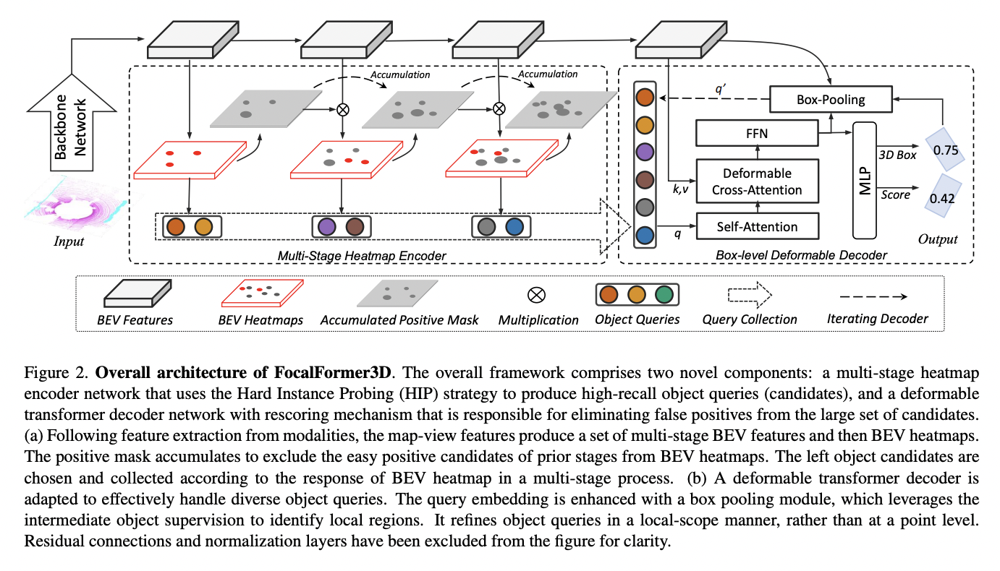

**Hard Instance Probing**:

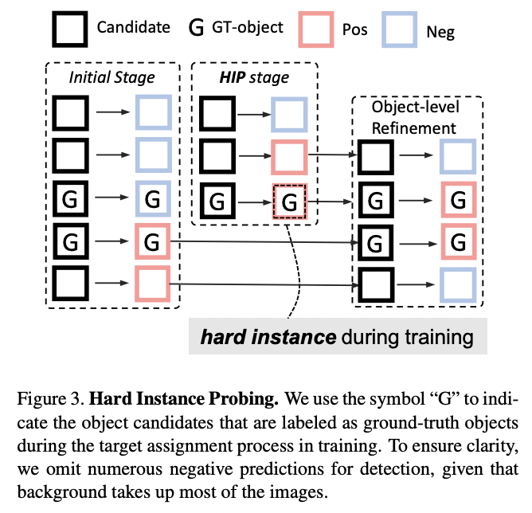

HIP的策略是逐阶段识别难以处理的实例。初始阶段，有一组GT实际目标对象O以及一组初始目标候选项A。网络在每个阶段根据这些候选项进行正面或负面的预测，其中候选项可以是各种类型，不仅限于anchor。每个阶段会产生一组已检测到的目标，然后根据它们与GT实际目标的匹配关系来分类实际目标。这种匹配可以使用不同的度量标准和阈值来实现。未匹配的实际目标将在后续阶段中继续处理，以提高检测的召回率。

**Multi- stage Heatmap Encoder**: BEV视角下的Heatmap是3D检测任务中对中心位置产生的高斯表示。根据不重叠的假设，作者提出了一种用于在训练期间指示正面目标候选项存在的方法。由于在推理时GT不可用，作者采用了一下遮挡方法：

点遮挡：仅填充正面候选项的中心点；

基于池化的遮挡：较小目标填充中心点，较大目标使用3*3内核大小填充；

目标框遮挡：需要额外的目标框预测分支，填充预测的BEV框的内部区域。

累积正面掩码（APM）通过累积先前阶段的正面掩码获得，通过遮挡BEV heatmap，在当前阶段省略了先前阶段的简单正面区域，使模型能够专注于先前阶段的加阴性样本。在训练和推断过程中，收集所有阶段的正面候选项，用于第二阶段的重新评分作为潜在FN预测。

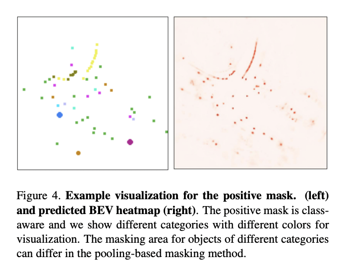

**Box-level Deformable Decoder**：Decoder阶段模型通过Multi- stage Heatmap Encoder生成目标候选项，这些候选项可以视为位置对象Queries。不增加FN的情况下提高初始候选项的recall。为提高效率使用了变形注意力，而不是计算密集型的模块。

**实验结果**：下表中的实验结果充分证明了FocalFormer3D模型的卓越性能。无论是在基于LiDAR的3D目标检测还是多模态3D目标检测方面，该模型都取得了显著的性能提升，甚至在一些罕见类别上也表现出色。值得注意的是在Lidar 单模态任务结合TTA的情况下 FocalFormer3D任务已经优于BEV-Fusion等单帧的多模态BEV融合任务了。

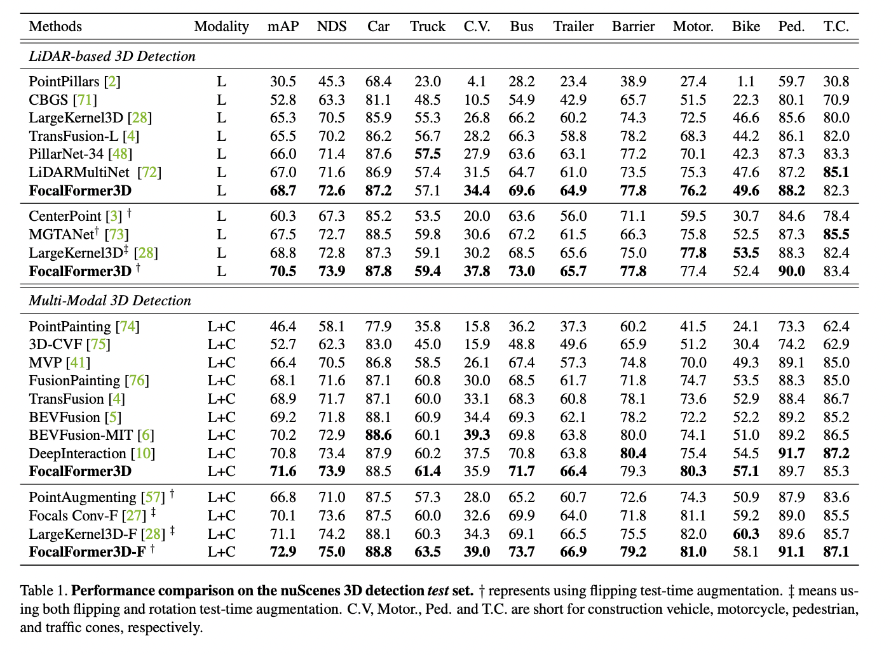

附：FocalFormer的改进其实是基于BEV Heatmap的，所以这个结构无论对于Lidar only，还是BEV Fusion或是Camera BEV的方案，原则上都是可行的，值得大家参考。

